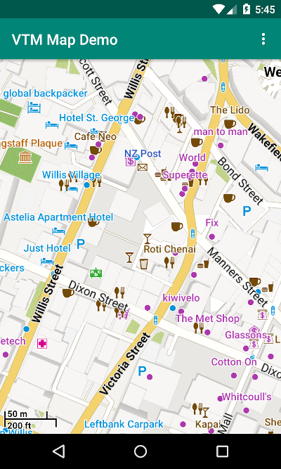

# VTM Android Maps Demo

## Usage

See: [BaseMapFragment.kt](app/src/main/java/danbroid/vtmdemo/BaseMapFragment.kt) and [MapFragment.kt](app/src/main/java/danbroid/vtmdemo/MapFragment.kt)

Your project will need the dependencies: 

- com.github.danbrough.vtm:vtm-android:0.12.0-dan01
- com.github.danbrough.vtm:vtm-http:0.12.0-dan01
- com.github.danbrough.vtm:vtm-themes:0.12.0-dan01

available through the jitpack maven portal and also the 

- android.permission.INTERNET
- android.permission.READ_EXTERNAL_STORAGE

permissions.

